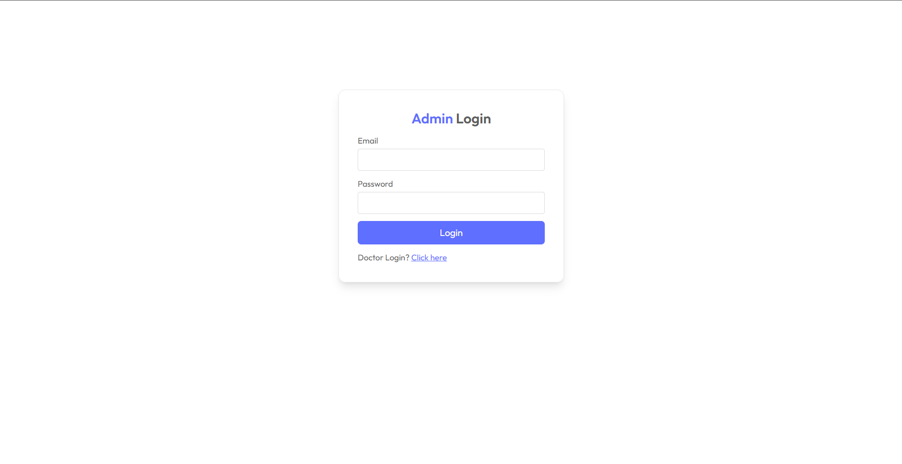
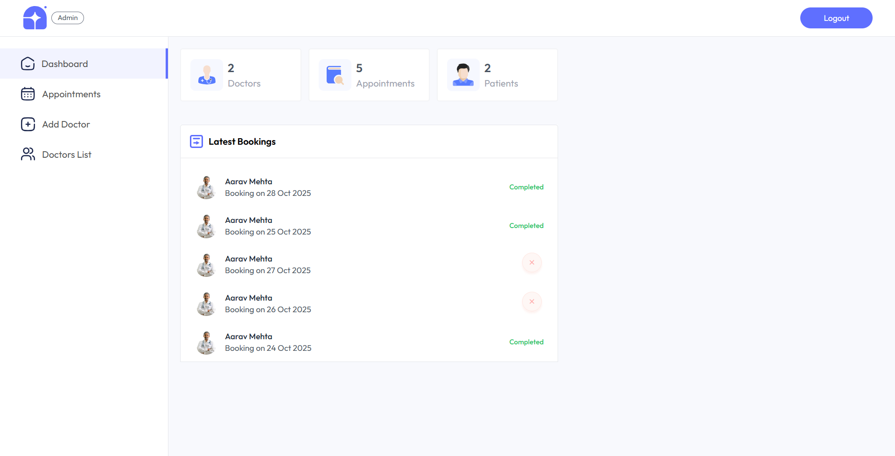
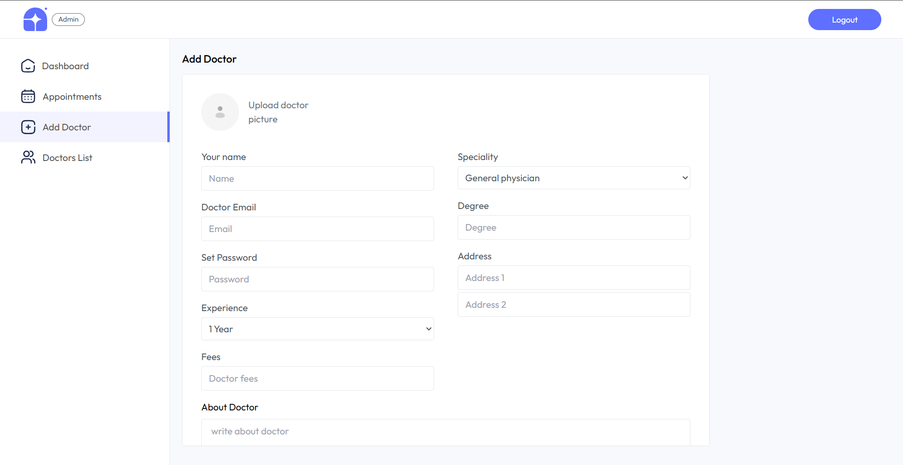
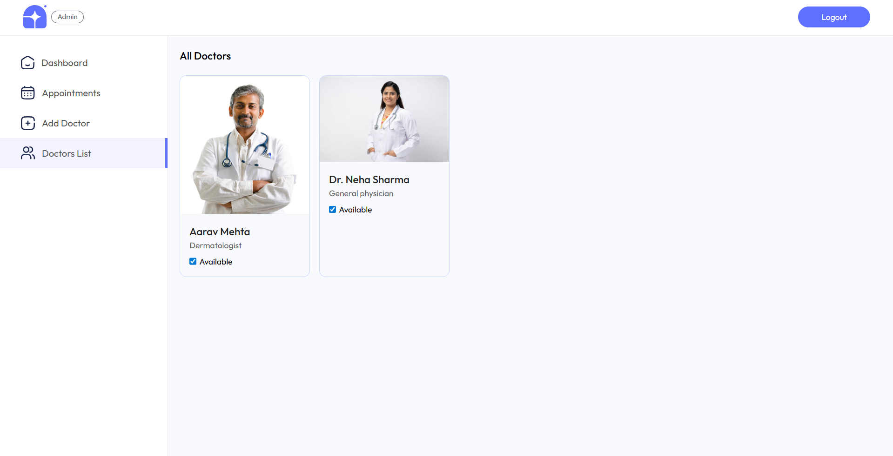
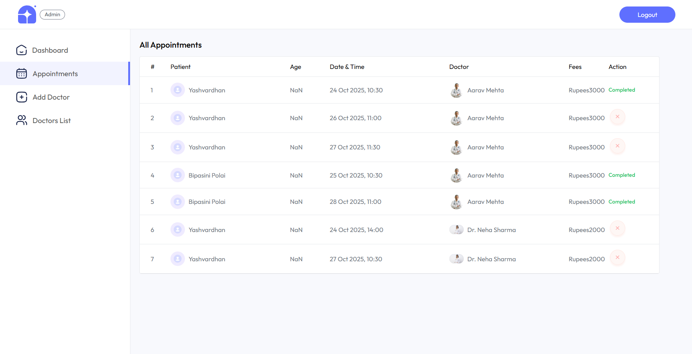
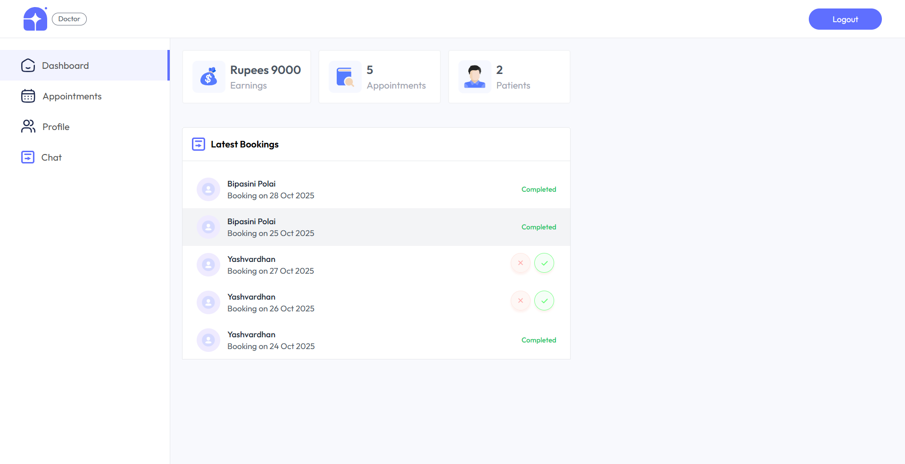
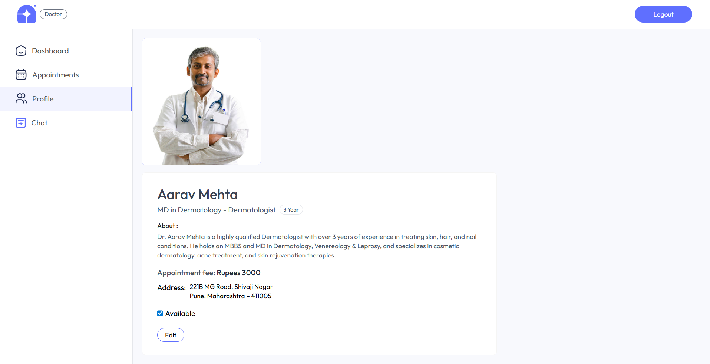
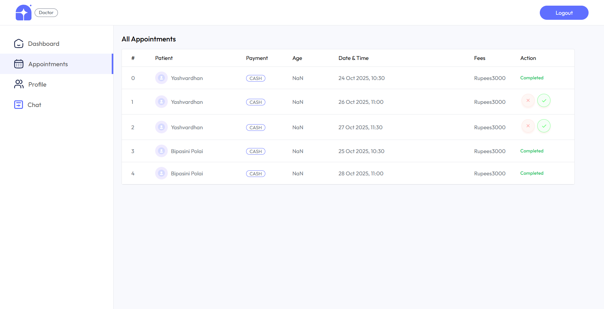
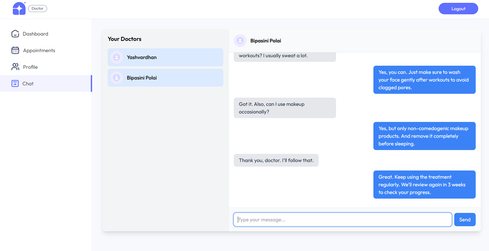

# MediConnect-Admin

🔗 **Live Demo**: [MediConnect-Admin](https://medi-connect-api-kmpz.vercel.app)

## Overview

MediConnect-Admin is a user-friendly web platform for managing medical appointments, designed for doctors and administrators. Built with **React**, **Vite**, and **Tailwind CSS**, it offers a fast, responsive interface. The platform includes real-time chat for doctors to communicate with patients, ensuring seamless interaction.

## Hosted Application

You can access the live application at [MediConnect-Admin](https://medi-connect-api-kmpz.vercel.app).

## Features

- **Secure Login**: Separate access for admins and doctors with role-based authentication.
- **Dashboards**: Clear, tailored dashboards showing key stats like appointments, earnings, and patient data.
- **Appointment Management**: Easily view, cancel, or complete appointments.
- **Doctor Management**: Admins can add doctors and update their availability.
- **Doctor Profiles**: Doctors can view and update their personal profiles.
- **Real-time Chat**: Doctors can connect with patients instantly via a built-in chat system.

## Screenshots

### Admin Login



### Admin Dashboard



### Add Doctor (Admin)



### Doctors List (Admin)



### Appointments (Admin)



### Doctor Dashboard



### Doctor Profile



### Doctor Appointments



### Doctor Chats



## Tech Stack

- **Frontend**: React, Vite, Tailwind CSS
- **Real-time Communication**: Socket.IO
- **Version Control**: Git
- **Hosting**: Vercel

## Prerequisites

Before setting up the project, ensure you have:

- [Node.js](https://nodejs.org/) (v16 or higher)
- [Git](https://git-scm.com/)
- A modern web browser (e.g., Chrome, Firefox)

## Installation

To set up MediConnect-Admin locally, follow these steps:

1. **Clone the Repository**:

   ```bash
   git clone https://github.com/yash1302/MediConnect-Admin.git
   ```

2. **Navigate to the Project Directory**:

   ```bash
   cd MediConnect-Admin
   ```

3. **Install Dependencies**:

   ```bash
   npm install
   ```

4. **Run the Development Server**:

   ```bash
   npm run dev
   ```

5. **Open the Application**:
   Open your browser and go to `http://localhost:5173` (or the port shown in the terminal).

## License

This project is licensed under the MIT License. See the [LICENSE](LICENSE) file for details.

## Contact

For questions or feedback, contact the project maintainer at [yash1302](https://github.com/yash1302).
